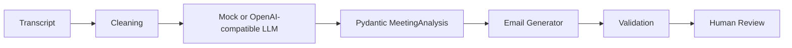

# AI Meeting Notes to Professional Email Assistant

**Status: Completed portfolio implementation with deterministic mock mode**

A portfolio application that turns synthetic meeting notes into a reviewable, professional email. It demonstrates a practical NLP workflow with structured Pydantic extraction, provider abstraction, validation, an API, and a Streamlit client.

## Problem
Meeting notes are often incomplete and unstructured. This application extracts a summary, decisions, action items, owners, deadlines, risks, dependencies, and open questions, then drafts a communication without inventing facts.

## Architecture



`app/llm/provider.py` selects the deterministic mock provider when `OPENAI_API_KEY` is absent. With a key, it calls any OpenAI-compatible chat completion endpoint. The API and Streamlit UI use the same pipeline.

## Workflow
Transcript -> cleaning -> meeting understanding -> information extraction -> decisions -> action items -> risks -> email generation -> validation -> human review -> final email.

## Example
Input:

```text
We discussed the production deployment.
Sunil will prepare the deployment checklist by Friday.
Database team needs to validate indexes.
The release may move to Saturday.
Need confirmation from QA.
```

The resulting draft includes the two action items with `Sunil`/`Friday` and `unknown` where the source has no owner or deadline, the release risk, and the QA open question.

## Run locally

```powershell
py -3.11 -m venv .venv
.\.venv\Scripts\Activate.ps1
pip install -r requirements.txt
Copy-Item .env.example .env
uvicorn app.main:app --reload
```

In another terminal:

```powershell
streamlit run streamlit_app/app.py
```

API: `http://localhost:8000`, docs: `http://localhost:8000/docs`, UI: `http://localhost:8501`.

## API

`GET /health`

`POST /api/v1/analyze`

```json
{"transcript":"Maya will send the plan by Wednesday."}
```

`POST /api/v1/generate-email`

```json
{"transcript":"Maya will send the plan by Wednesday.","email_type":"project status","tone":"concise"}
```

## Evaluation
`evaluation/dataset.json` contains 30 synthetic transcripts covering actions, missing fields, decisions, risks, dependencies, and questions. Run:

```powershell
python evaluation/run_evaluation.py
```

The script reports action counts, extracted owners, deadlines, and risks. For a production benchmark, add human-labeled expected JSON and score precision/recall, summary faithfulness, email completeness, and unsupported-claim rate.

## Security
- Secrets come from environment variables and `.env` is ignored.
- Transcript size is bounded and whitespace/NUL characters are normalized.
- Transcript is passed as untrusted data; the model system prompt explicitly ignores embedded instructions.
- Pydantic rejects unexpected structured fields.
- Logs contain request IDs, timings, status, and errors, but not transcript content or secrets.
- Human review is required; the app never sends email.

## Docker

```powershell
Copy-Item .env.example .env
docker compose up --build
```

API is on port 8000, Streamlit on 8501, and PostgreSQL on the internal Compose network. PostgreSQL is included as the persistence-ready service boundary; the current demo keeps analysis stateless.

## Testing

```powershell
pytest -q
```

Tests cover structured extraction, missing fields, invalid dates, prompt injection resistance, email completeness, API validation, and generation options.

## Screenshots
Run the Streamlit UI locally and capture the transcript, analysis tabs, and edited email for a GitHub screenshot. No external or private meeting data is included in this repository.

## Limitations
The mock extractor uses conservative English rules and is not a substitute for a labeled NLP benchmark. Date normalization, speaker resolution, persistence, authentication, and outbound email delivery are intentionally outside this portfolio demo.

## Future improvements
Add a labeled evaluation set with faithfulness grading, database-backed history, authentication and RBAC, dates normalized to a supplied timezone, streaming generation, redaction, multilingual extraction, and review audit trails.

## Resume bullets
- Built a FastAPI and Streamlit NLP application that converts meeting transcripts into Pydantic-validated summaries, decisions, action items, risks, and professional emails.
- Designed a provider abstraction with deterministic mock mode and OpenAI-compatible structured extraction, including hallucination checks and prompt-injection defenses.
- Added Docker Compose, PostgreSQL readiness, 30 synthetic evaluation cases, API tests, and observability for request IDs, latency, errors, and validation failures.

## Interview explanation
I separated extraction from generation so each stage has a typed contract and can be tested independently. The provider interface keeps local development deterministic when no API key exists. Validation then checks that every extracted action, owner, and deadline is represented in the email and records warnings instead of silently producing a confident but unsupported draft. The user remains the final reviewer.

## GitHub commands

```powershell
git init
git add .
git commit -m "Build meeting notes to professional email assistant"
git branch -M main
git remote add origin https://github.com/suniljavadi/Meeting-Notes-Professional-Email.git
git push -u origin main
```

Synthetic data only. Licensed under MIT.
